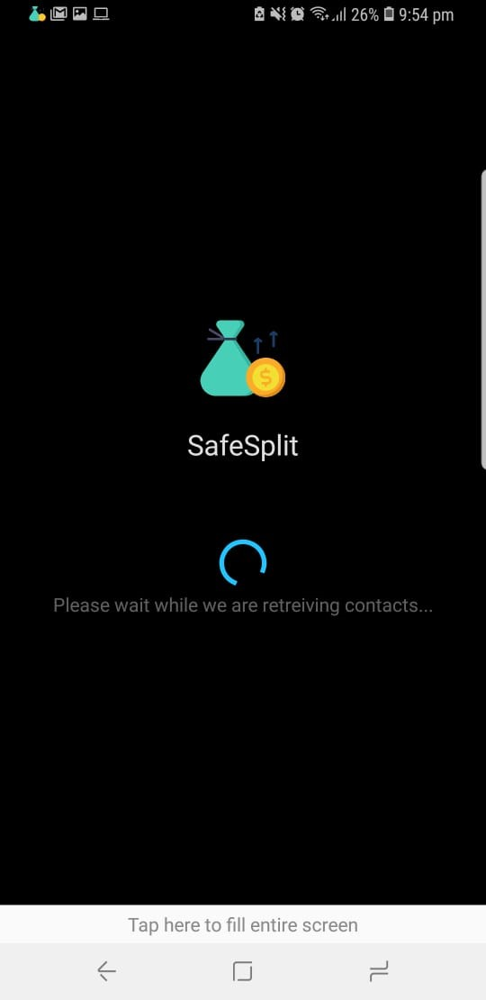
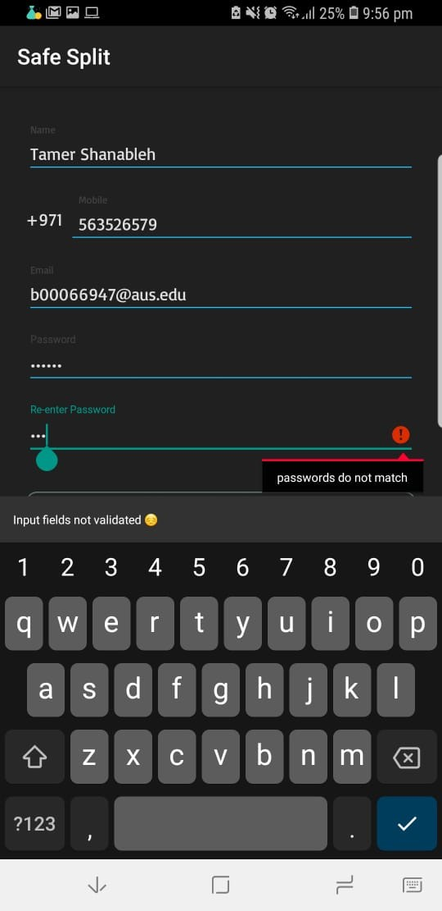
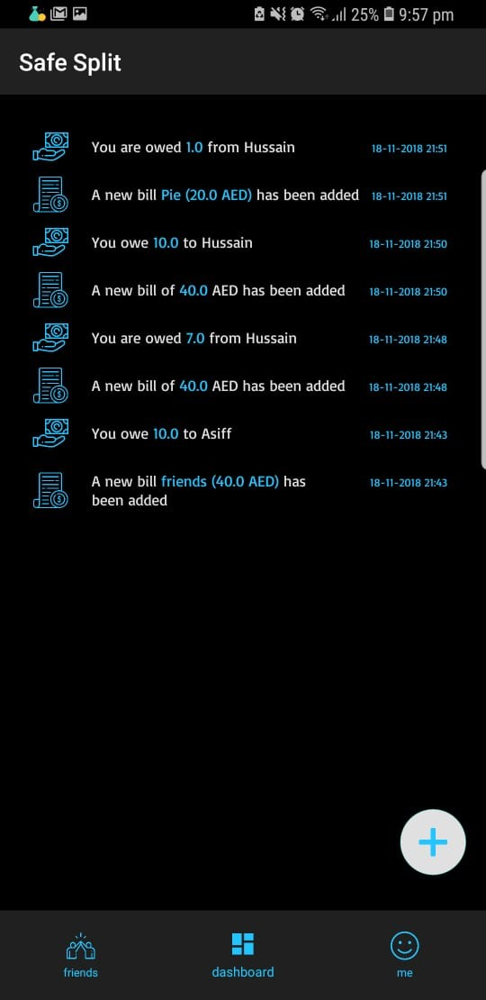
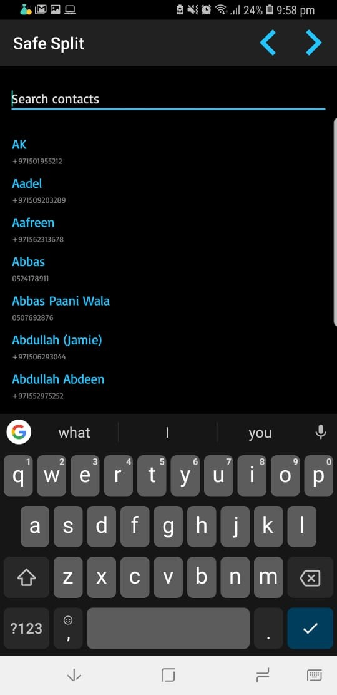
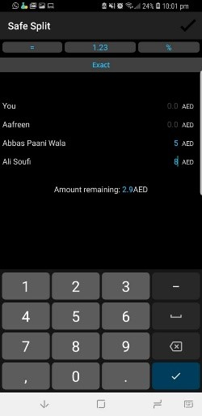
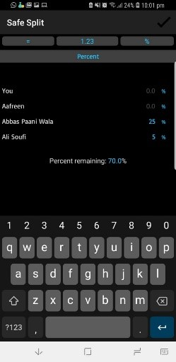

# Safesplit - [CMP 354] Mobile-Application-Development
Designed and implemented a running android mobile application that stores a record of ‘money owed’, ‘money owe’ and ‘total balance’ among groups of people after splitting a bill. Tools: Java/Android (Android Studio)

## User Journey
 
#### Loading Screen

When the user first opens the app, he sees the loading
Screen, where the users contacts are being retrieved
For being used within the app. Once this is complete
User is taken to the Sign in Activity

#### Sign in Activity

User can do the following:
1.	Enter email and password to login
2.	Have error messages come if either of
The fields do not match the criteria
3.	Press login to login into the app
4.	Once user presses login, the progress bar is shown to verify user
5.	Press Create one to sign up for the app
6.	If login fails for any reason, a snackbar at the bottom of the screen is shown

#### Sign up Activity

1.	Enter user details to sign in. Details include Name, Mobile, Email and Password
2.	There are valid error messages for each of the field
3.	User can click create account to create the account, after which he is directly sent onto the app home screen
4.	User can click already a member? Login, to go back to the sign in activity
5.	User can click create account and a progress loader will show up for verifying new account
6.	If any error occurs, a snackbar is shown at the bottom of the screen

#### HomeScreen

The home screen is divided into 3 navbar items:
-	Friends
-	Dashboard
-	Profile
The user can also click the ‘+’ floating button to add a new bill
Friends NavItem
1.	The user sees 3 tabs – Money Owed, Money Owe, Total Balance
2.	Each tab represents the transactions the user is yet to ‘settle up’. So Money Owe is the people who owe the user, Money Owed is people who the user owes to, and total balance is the net owe/owed for the user
3.	Each item in the list shows the person’s name and number, as well as the net owe/owed
4.	Each item in the list has a button to settle up. This means that the user has settle up his debt with the respective person.
5.	A dialog box shows up when pressing the button, asking the user whether he/she wants to settle up or not
6.	Once the user has settled up, the item is removed from the list
  
#### Dashboard navItem

1.	Here, the user sees the history of all the activities the user has been involved in within the app
2.	Each item in the list has details of the activity, an image to determine the activity type, and the time the activity took place
3.	The list is real-time and is ordered by time, with the most recent one on top
4.	The types of activities are as follows
a.	New Bill
b.	Settle up
c.	Change email/password
d.	Whenever you owe/owed to someone
5.	The list is view-only and a good way for the user to keep track of his expenses

#### Profile NavItem

1.	Here the user sees his name, and email-address
2.	The user can change his email address and password, both of which will open dialogs allowing the user to change them
3.	Once the user changes his details, the result is instant (his email-address changes in profile view)
4.	The user can click the sign out button to sign out of the app. He will be taken to the login page
5.	App copyright details are shown at the bottom of the view
 
#### No internet connection service

1.	When the user is using the app and the internet connection is gone, a permanent snackbar is shown at the bottom of the screen
2.	The snackbar is removed when internet connection comes back
3.	When disconnected from the internet, the user cant:
a.	Add a new bill
b.	Settle up
c.	Change email/password
d.	Login if not already
4.	When disconnected, the user can view the list of transactions and the dashboard list, that was already downloaded from before, and he will stay logged in if he already was before internet loss

#### Notification service

1.	The user can receive notifications within the app
2.	The notifications are the same as the items on the dashboard of the app
3.	The notifications work for all APKs, even 26+

#### Add Users:

1.	The user can select users for adding into the bill by selecting his contacts displayed in a list. The number of the contact is also shown.
2.	Each contact has a unique number, and duplicate contacts are removed from the list while retrieving.
3.	The user may only select users from his contacts. If the user attemps to enter contacts apart from the ones in his contact list, they are discarded.
4.	The user may also select the contact by selecting a contact displayed in the dropdown of the multiautocompletetextview.  
5.	The next option will display a toast asking the user to select at least 1 contact, if he hasn’t.
 
#### Add Bill:

1.	The user can add a description to his bill, which will be displayed on his dashboard.
2.	The user must add an amount before proceeding into any other action (paid by, split by, done). If not, he will be displayed error messages asking him to enter an amount.
3.	The user may directly select done by selecting the menu item (tick), if he wants to proceed with the default settings (paid by you and split equally).
4.	The user can select the paid by button to select who payed the bill.
5.	He is displayed a dialogue asking him to make a selection. He may select a single person or select custom if multiple people have paid for the bill.
 
#### Custom Payment:

1.	The user can enter the amounts payed by each user.
2.	If the user has entered a larger total value of the individual amounts and attempts to proceed, he will be displayed an error message asking him to reduce it by the extra amount entered. A similar message is shown if he enters a smaller value and attempts to proceed.
3.	Once the right total amount is entered, the individual amounts are stored and assigned to the respective payers.
4.	The button in addbill then displayes ‘custom’. In case the user has entered the entire amount for only 1 user, the button in addbill displays the name of that one user, instead of ‘custom’.

#### Split Equally:

1.	The user can select/deselect those who are supposed to be splitting the amount.
2.	Upon selection/deselection, the amount per person is displayed in a textview.
3.	The user must select at least one of the participants. If the user attempts to deselect the only selected participant, an error message is displayed, and the deselection fails.
4.	On clicking the menu item done (tick), the split value is stored for the participants who are ticked.

#### Split Exact Amounts:

1.	The user can enter the amounts payed by each user.
2.	While entering values, the amount remaining is displayed in a textview.
3.	If the user has entered a wrong total value and attempts to proceed, he will be displayed an error message asking him to enter the right amounts to sum them up to the total.
4.	Once the right total amount is entered and the menu item done (tick) is clicked, the individual amounts are stored and assigned to the respective payers.

#### Split By Percentage:

1.	The user can enter the percentage payed by each user.
2.	While entering values, the percentage remaining is displayed in a textview.
3.	If the user has entered a total percentage lesser than 100 and attempts to proceed, he will be displayed an error message asking him to enter the right percentages to sum them up to 100.
4.	Once the right total percentage is entered and the menu item done (tick) is clicked, the individual percentages are converted to amounts and are stored and assigned to the respective payers.

Once the user wants to create the bill, he presses the tick icon, then the dialog to confirm the creation is shown
1.	The bill is sent to be created, and notifications are sent to all people involved
2.	The Dashboards of all the people involved in the bill are updated
3.	The Friends tab of all the people involved in the bill are updated, with new amounts they are owe/owed
